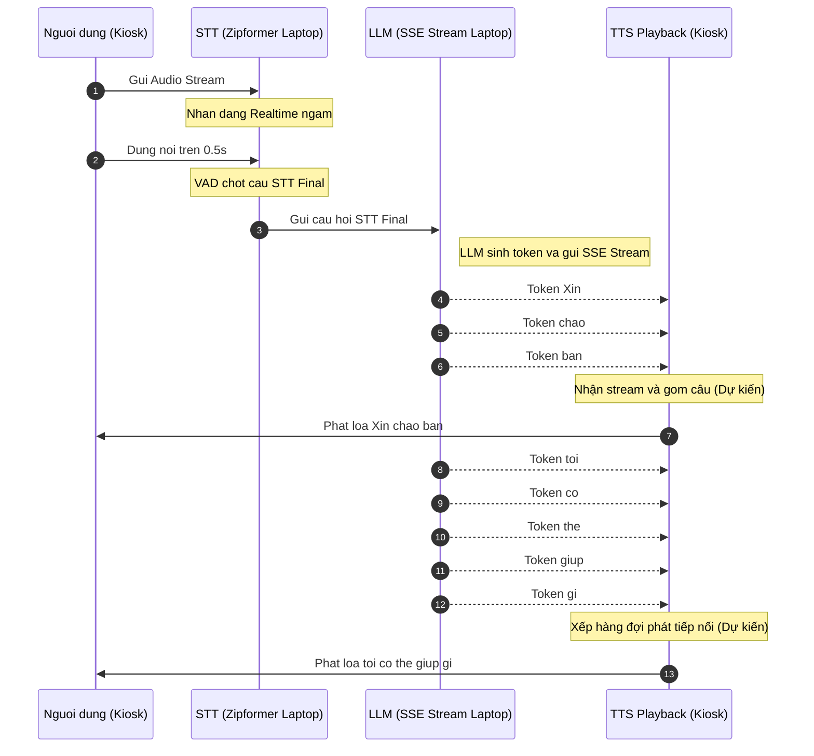

# Kiến Trúc Tích Hợp STT - LLM - TTS Realtime (Đề Xuất)

Tài liệu này ghi lại phân tích kỹ thuật về **hai mô hình tích hợp realtime** điều phối luồng dữ liệu dự kiến từ Microphone $\rightarrow$ Nhận dạng (STT) $\rightarrow$ Suy nghĩ (LLM) $\rightarrow$ Phát loa (TTS - Phương án dự kiến).

---

## HAI MÔ HÌNH TÍCH HỢP STT - LLM (SSE) - TTS REALTIME

### MÔ HÌNH 1: Turn-Based Pipeline (Đợi Điểm Ngắt Câu) - Khuyên Dùng
*Đây là kiến trúc chuẩn công nghiệp, tối ưu hóa tài nguyên phần cứng local và kiểm soát trạng thái ngắt lời (interruption) một cách hoàn hảo nhất.*



#### Cách hoạt động chi tiết:
1.  **Giai đoạn ghi nhận**: Kiosk stream liên tục audio sang Laptop. Laptop nhận dạng ngầm, sinh ra text realtime để hiển thị và làm dữ liệu đầu vào cho bộ lọc VAD (Voice Activity Detection).
2.  **Giai đoạn chốt câu**: Khi VAD phát hiện khoảng lặng (silence) lớn hơn ngưỡng cài đặt (ví dụ: `0.5 giây`), hệ thống chốt câu hoàn chỉnh gọi là `STT Final`. Câu Final này mới được gửi sang LLM qua một yêu cầu duy nhất.
3.  **Giai đoạn LLM sinh chữ**: LLM nhận câu Final và bắt đầu sinh câu trả lời. Để giảm trễ, LLM stream từng từ (token) trả về Client qua kết nối **Server-Sent Events (SSE)** hoặc WebSocket.
4.  **Giai đoạn phát loa TTS (Phương án đề xuất - Sẽ thử nghiệm quy trình sau)**: 
    *   *Phương án dự kiến*: Client (Kiosk) nhận các từ đơn lẻ từ LLM. Để tránh giọng đọc bị giật cục, Kiosk có thể sử dụng một bộ đệm gom từ thành câu ngắn (ngăn cách bởi dấu phẩy, dấu chấm) trước khi đẩy vào engine TTS.
    *   *Quy trình thực tế*: Sẽ được thiết lập và kiểm thử chi tiết sau khi giai đoạn tích hợp LLM hoàn thành.

#### Ưu & Nhược điểm:
*   **Ưu điểm**:
    *   **Cực kỳ ổn định**: Tránh việc bot tự động nói xen vào khi người dùng đang ngập ngừng suy nghĩ giữa câu.
    *   **Tiết kiệm tài nguyên**: Tiết kiệm GPU/CPU Laptop tối đa vì LLM chỉ chạy khi người dùng đã nói xong.
*   **Nhược điểm**: Có độ trễ cảm giác nhỏ khoảng 0.5s - 1s từ lúc dứt lời đến khi bot phát ra âm thanh đầu tiên.

---

### MÔ HÌNH 2: Full-Duplex Realtime Pipeline (Gửi Chữ Liên Tục Sang LLM)
*Kiến trúc này hướng tới tốc độ phản hồi cực nhanh bằng cách cho LLM xử lý trước, nhưng đòi hỏi tài nguyên tính toán cực mạnh và logic xử lý ngắt lời rất phức tạp.*

#### Cách hoạt động chi tiết:
1.  **Gửi liên tục**: Khi người dùng đang nói, chữ `STT Realtime` (chưa chốt) được stream liên tục từng từ sang cho LLM.
2.  **LLM tính toán trước**: LLM nhận các từ này và bắt đầu tính toán ma trận Attention (KV Caching) cho các từ đã nói để sẵn sàng. LLM chưa sinh ra từ mới vì biết người dùng chưa nói xong.
3.  **Dự đoán điểm ngắt**: Khi mô hình phát hiện câu nói đã đủ ý nghĩa ngữ pháp và người dùng hơi ngập ngừng, nó có thể chủ động sinh từ trả lời trước khi người dùng dừng nói hẳn.
4.  **Thử thách ngắt lời (Interruption)**: Nếu người dùng đổi ý nói tiếp hoặc nói một câu khác, LLM lập tức phải huỷ (cancel) luồng stream cũ, xóa cache tính toán nháp và chạy lại từ đầu. TTS cũng phải lập tức tắt loa ngay khi người dùng cất tiếng nói xen vào.

#### Ưu & Nhược điểm:
*   **Ưu điểm**: Phản hồi siêu tốc (gần như 0ms trễ cảm giác).
*   **Nhược điểm**: Cực kỳ tốn tài nguyên GPU; logic xử lý ngắt lời rất phức tạp, dễ xảy ra hiện tượng bot nói chồng lên người dùng hoặc trả lời sai ngữ cảnh do nhận diện sai realtime.

---

## III. CÁC ISSUES PHÁT SINH TRONG THỬ NGHIỆM THỰC TẾ & KHẮC PHỤC

Trong quá trình thực hiện kiểm thử E2E liên kết LAN giữa Microphone Kiosk $\rightarrow$ Laptop STT $\rightarrow$ Local LLM, hệ thống đã phát hiện một số vấn đề kỹ thuật quan trọng dưới đây và đã được khắc phục/ghi nhận:

### Issue 01: Tốc Độ Sinh Chữ Của LLM Bị Chậm & Ảnh Hưởng Bởi Luồng Suy Nghĩ (Thinking)
*   **Triệu chứng**: Thời gian sinh câu trả lời của Qwen/Ollama trên Laptop kéo dài, tạo cảm giác phản hồi chậm chạp cho người dùng Kiosk.
*   **Nguyên nhân**:
    1.  **Chế độ Suy nghĩ (Thinking Tokens)**: Một số mô hình suy nghĩ như `DeepSeek-R1` hoặc các bản Qwen tối ưu suy nghĩ sẽ sinh ra hàng trăm token suy nghĩ nằm trong cặp thẻ `<think>...</think>` trước khi bắt đầu câu trả lời chính thức. Việc truyền thô cả luồng suy nghĩ này sang Kiosk làm tăng đáng kể độ trễ phản hồi cảm giác (Time to First Token hữu ích) và gây rối giao diện.
    2.  **Tranh chấp tài nguyên VRAM (CPU vs GPU)**: Do Laptop vừa phải gánh luồng xử lý nhận dạng giọng nói nặng **Zipformer STT** trên GPU, nếu bộ nhớ đồ họa (VRAM) bị chiếm dụng quá nhiều, Ollama sẽ tự động chuyển một phần hoặc toàn bộ các layer của LLM sang CPU để tính toán. Điều này làm tốc độ suy luận giảm đột ngột từ ~30-40 tokens/s xuống còn ~1-2 tokens/s.
*   **Giải pháp đã tích hợp & Khuyến nghị**:
    *   *Đã tích hợp bộ lọc `<think>`*: Cập nhật thành công bộ lọc trong `server.py` (`trigger_llm_flow`). Khi phát hiện token `<think>`, hệ thống sẽ ẩn luồng suy nghĩ này khỏi client Kiosk và chỉ in nhạt màu trên terminal Laptop để debug dạng `[Suy nghĩ... Xong]`. Kiosk sẽ nhận phản hồi sạch và phản hồi tức thì khi câu trả lời chính thức bắt đầu.
    *   *Khuyến nghị VRAM*: Khởi chạy Ollama với tham số giới hạn bộ nhớ hoặc sử dụng mô hình lượng tử hóa nhẹ hơn (ví dụ: `qwen2.5:1.5b-instruct` hoặc `qwen2.5:3b-instruct` chuẩn không có thinking) để đảm bảo mô hình nằm hoàn toàn trong VRAM GPU RTX 5060, giữ tốc độ sinh từ tối đa.

### Issue 02: Hiện Tượng Lặp Âm Cuối Do VAD (ASR Tail Repetition)
*   **Triệu chứng**: Zipformer thỉnh thoảng nhận diện lặp từ ở cuối câu khi người dùng dứt lời nói (ví dụ: `ĐÂU.ÂU`, `GÌ.GÌ`).
*   **Nguyên nhân**: Do sự nhạy cảm của bộ ngắt câu VAD (Voice Activity Detection) khi xử lý tiếng ồn môi trường hoặc tiếng vọng (echo) của âm tiết cuối cùng.
*   **Giải pháp đã tích hợp**:
    *   *Đã tích hợp bộ lọc Regex*: Sử dụng biểu thức chính quy (`re.sub`) trong `trigger_llm_flow` để tự động dò tìm và cắt bỏ các âm tiết lặp dạng `TÊN.ÊN` hoặc `ĐÂU.ÂU` ở cuối câu trước khi đưa vào LLM, đảm bảo nội dung câu hỏi đưa vào AI sạch 100%.

### Issue 03: Lỗi Mất Tiếng Do Luồng TTS Bị Hủy & Lỗi Trôi Tiếng Trung (Qwen)
*   **Triệu chứng**: Loa phát TTS bị câm hoàn toàn sau câu nói đầu tiên, đồng thời LLM Qwen2.5:7B thỉnh thoảng chèn thêm ký tự tiếng Trung ở đuôi phản hồi (ví dụ: `Bạn cần giúp gì`).
*   **Nguyên nhân**:
    1.  **Hủy tiểu trình TTS vĩnh viễn**: Trong `LaptopTTSPlayer._worker`, vòng lặp chính của luồng ẩn được kiểm soát bằng `while not self._stop_event.is_set():`. Khi có sự kiện ngắt lời (STT FINAL), hệ thống gọi `interrupt()` để dừng loa ngay lập tức bằng cách kích hoạt `self._stop_event.set()`. Việc này vô tình làm thoát hoàn toàn khỏi vòng lặp và giết chết luồng TTS vĩnh viễn. Các câu tiếp theo sẽ bị kẹt lại trong hàng đợi mà không thể đọc.
    2.  **Lệch ngôn ngữ của Qwen**: Qwen2.5:7B tuy rất thông minh nhưng khi nhận đầu vào cực ngắn hoặc trong môi trường cục bộ, đôi khi nó tự chèn thêm câu xã giao bằng chữ Hán ở cuối lời thoại.
*   **Giải pháp đã tích hợp**:
    1.  **Sửa lỗi Thread Lifetime**: Đổi điều kiện vòng lặp luồng TTS sang cờ trạng thái dài hạn `while self._is_active:`. Cờ `self._stop_event` được tách biệt hoàn toàn để chỉ dùng để ngắt âm phát hiện tại, và được gọi `clear()` tự động trước khi nạp câu mới.
    2.  **Bộ lọc Tiếng Trung Triệt Để (Regex-based Filter)**:
        *   Nâng cấp Prompt hệ thống chỉ định rõ: `"Bạn là trợ lý ảo tiếng Việt tại quầy dịch vụ công Kiosk tự động. Hãy trả lời câu hỏi của người dân bằng TIẾNG VIỆT 100%. TUYỆT ĐỐI KHÔNG dùng chữ Trung Quốc..."`
        *   Tích hợp bộ lọc Regex mạnh mẽ để lọc bỏ hoàn toàn các ký tự chữ Hán và dấu câu tiếng Trung full-width trong quá trình stream chữ:
            `clean_token = re.sub(r'[\u4e00-\u9fff\u3000-\u303f\uf900-\ufaff\uff00-\uffef]', '', token)`
            Đảm bảo hiển thị trên terminal và gửi về Kiosk luôn sạch 100% tiếng Việt.

### Issue 04: Lỗi Vòng Lặp Tự Thoại (Acoustic Echo Loop) & Di Chuyển TTS Về Kiosk (Tổng Hợp Tại Laptop - Phát Tại Kiosk)
*   **Triệu chứng**: Khi Laptop/Kiosk phát âm thanh trả lời, Microphone của Kiosk thu lại chính giọng đọc đó và gửi ngược lại cho Server xử lý thành câu hỏi mới (`STT FINAL`), tạo nên một chuỗi hội thoại lặp đi lặp lại vô tận.
*   **Nguyên nhân**: Do Laptop (chạy Server) và Kiosk (chạy Client) đặt gần nhau trong môi trường kiểm thử. Khi phát âm thanh, Microphone thu lại rõ mồm một qua không khí hoặc qua driver loopback, hiểu nhầm đó là tiếng người dùng nói.
*   **Giải pháp đã tích hợp (Mô hình Phân Tán Kết Hợp Tối Ưu)**:
    1.  **Tách biệt Cơ chế Tổng hợp (Laptop) và Phát loa (Kiosk)**:
        *   **Laptop Server (Heavy Lifting)**: Vẫn đảm nhiệm cơ chế xử lý cốt lõi, sử dụng engine WinRT `SpeechSynthesizer` và giọng **Microsoft An** chất lượng cao để tổng hợp văn bản thành **bytes dữ liệu âm thanh WAV thô trực tiếp trong bộ nhớ (in-memory)** một cách siêu tốc và thread-safe.
        *   **WebSocket Stream**: Dữ liệu WAV thô được mã hóa Base64 và truyền tải ngay lập tức về Kiosk client qua sự kiện WebSocket `tts_audio`.
        *   **Kiosk Client (Lightweight Playback)**: Kiosk chỉ việc giải mã Base64 và phát âm thanh trực tiếp từ bộ nhớ bằng `winsound.PlaySound(wav_bytes, winsound.SND_MEMORY | winsound.SND_ASYNC)`. Kiosk **hoàn toàn không cần cài đặt engine TTS hay gói ngôn ngữ WinRT**, giảm tối đa độ phức tạp và tài nguyên cho client.
    2.  **Khử tiếng vọng chủ động bằng cơ chế Mute Microphone tại Client**:
        *   Trong suốt quá trình `KioskTTSPlayer` đang phát loa trả lời (`self.tts_player.is_speaking() == True`), client Kiosk sẽ **chủ động dừng truyền các gói tin ghi âm nhị phân Microphone sang Laptop Server**.
        *   Điều này giúp triệt tiêu hoàn toàn 100% tiếng vọng từ loa phát (acoustic/speaker driver) ngay tại nguồn trước khi nó có cơ hội gửi sang Server để nhận dạng.
        *   Khi Kiosk phát xong câu nói, Microphone tự động truyền tải âm thanh bình thường để nhận diện câu nói tiếp theo của người dùng. Giúp loại bỏ hoàn toàn vòng lặp tự thoại mà vẫn giữ nguyên khả năng ngắt lời chủ động (interruption) khi dứt câu.

### Issue 05: Lỗi Di Chuyển Thư Mục Ổ Đĩa Không Tồn Tại (`cd : Cannot find drive. A drive with the name 'D' does not exist`)
*   **Triệu chứng**: Gặp lỗi `DriveNotFoundException` trong PowerShell khi chạy lệnh `cd D:\work\project_company\kiosk` trên thiết bị đầu cuối Kiosk.
*   **Nguyên nhân**: Kiosk thực tế thường được phân vùng tối giản và chỉ có ổ đĩa `C:`. Việc sao chép trực tiếp câu lệnh hướng dẫn của Laptop (vốn nằm trên ổ `D:`) sang Kiosk sẽ gây ra lỗi không tìm thấy phân vùng.
*   **Cách khắc phục**:
    1. Xác định thư mục clone thực tế của dự án trên thiết bị Kiosk (thông thường là `C:\work\project_company\kiosk` hoặc thư mục do quản trị viên thiết lập).
    2. Điều hướng chính xác theo ổ đĩa thực tế trên Kiosk:
       ```powershell
       cd C:\work\project_company\kiosk
       ```

### Issue 06: Lỗi Kết Nối Bị Từ Chối (`WinError 1225 The remote computer refused the network connection`)
*   **Triệu chứng**: Client Kiosk báo lỗi không thể kết nối hoặc duy trì liên lạc với Server khi chạy lệnh gọi:
    `python experiments\realtime_voicebot_lab\kiosk_laptop_conn_test\client_test.py --server ws://127.0.0.1:8012/ws/transcribe ...`
*   **Nguyên nhân**: Địa chỉ `127.0.0.1` (localhost) là địa chỉ loopback nội bộ. Khi chạy lệnh này trên Kiosk, Client sẽ cố gắng kết nối tới cổng `8012` của **chính thiết bị Kiosk**, trong khi dịch vụ backend thực tế đang chạy trên **Laptop máy chủ**. Do Kiosk không mở cổng `8012` nên kết nối bị từ chối ngay lập tức.
*   **Cách khắc phục**:
    1. Lấy địa chỉ IP mạng nội bộ (LAN IP) của Laptop bằng cách chạy lệnh `ipconfig` trên terminal Laptop (ví dụ: `192.168.1.234`).
    2. Thay đổi tham số truyền `--server` trên client Kiosk trỏ đúng về IP của Laptop:
       ```powershell
       python experiments\realtime_voicebot_lab\kiosk_laptop_conn_test\client_test.py --server ws://192.168.1.234:8012/ws/transcribe --mode stt --source mic
       ```
