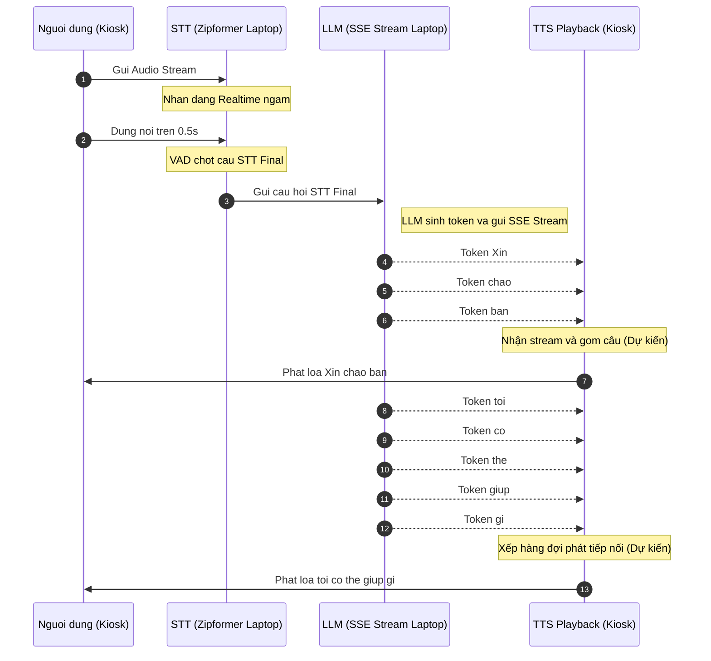

# Kiến Trúc Tích Hợp STT - LLM - TTS Realtime (Đề Xuất)

Tài liệu này ghi lại phân tích kỹ thuật về **hai mô hình tích hợp realtime** điều phối luồng dữ liệu dự kiến từ Microphone $\rightarrow$ Nhận dạng (STT) $\rightarrow$ Suy nghĩ (LLM) $\rightarrow$ Phát loa (TTS - Phương án dự kiến).

---

## HAI MÔ HÌNH TÍCH HỢP STT - LLM (SSE) - TTS REALTIME

### MÔ HÌNH 1: Turn-Based Pipeline (Đợi Điểm Ngắt Câu) - Khuyên Dùng
*Đây là kiến trúc chuẩn công nghiệp, tối ưu hóa tài nguyên phần cứng local và kiểm soát trạng thái ngắt lời (interruption) một cách hoàn hảo nhất.*

#### Cách hoạt động chi tiết:
1.  **Giai đoạn ghi nhận**: Kiosk stream liên tục audio sang Laptop. Laptop nhận dạng ngầm, sinh ra text realtime để hiển thị và làm dữ liệu đầu vào cho bộ lọc VAD (Voice Activity Detection).
2.  **Giai đoạn chốt câu**: Khi VAD phát hiện khoảng lặng (silence) lớn hơn ngưỡng cài đặt (ví dụ: `0.5 giây`), hệ thống chốt câu hoàn chỉnh gọi là `STT Final`. Câu Final này mới được gửi sang LLM qua một yêu cầu duy nhất.
3.  **Giai đoạn LLM sinh chữ**: LLM nhận câu Final và bắt đầu sinh câu trả lời. Để giảm trễ, LLM stream từng từ (token) trả về Client qua kết nối **Server-Sent Events (SSE)** hoặc WebSocket.
4.  **Giai đoạn phát loa TTS (Phương án đề xuất - Sẽ thử nghiệm quy trình sau)**: 
    *   *Phương án dự kiến*: Client (Kiosk) nhận các từ đơn lẻ từ LLM. Để tránh giọng đọc bị giật cục, Kiosk có thể sử dụng một bộ đệm gom từ thành câu ngắn (ngăn cách bởi dấu phẩy, dấu chấm) trước khi đẩy vào engine TTS.
    *   *Quy trình thực tế*: Sẽ được thiết lập và kiểm thử chi tiết sau khi giai đoạn tích hợp LLM hoàn thành.

#### Ưu & Nhược điểm:
*   **Ưu điểm**:
    *   **Cực kỳ ổn định**: Tránh việc bot tự động nói xen vào khi người dùng đang ngập ngừng suy nghĩ giữa câu.
    *   **Tiết kiệm tài nguyên**: Tiết kiệm GPU/CPU Laptop tối đa vì LLM chỉ chạy khi người dùng đã nói xong.
*   **Nhược điểm**: Có độ trễ cảm giác nhỏ khoảng 0.5s - 1s từ lúc dứt lời đến khi bot phát ra âm thanh đầu tiên.

---

### MÔ HÌNH 2: Full-Duplex Realtime Pipeline (Gửi Chữ Liên Tục Sang LLM)
*Kiến trúc này hướng tới tốc độ phản hồi cực nhanh bằng cách cho LLM xử lý trước, nhưng đòi hỏi tài nguyên tính toán cực mạnh và logic xử lý ngắt lời rất phức tạp.*

#### Cách hoạt động chi tiết:
1.  **Gửi liên tục**: Khi người dùng đang nói, chữ `STT Realtime` (chưa chốt) được stream liên tục từng từ sang cho LLM.
2.  **LLM tính toán trước**: LLM nhận các từ này và bắt đầu tính toán ma trận Attention (KV Caching) cho các từ đã nói để sẵn sàng. LLM chưa sinh ra từ mới vì biết người dùng chưa nói xong.
3.  **Dự đoán điểm ngắt**: Khi mô hình phát hiện câu nói đã đủ ý nghĩa ngữ pháp và người dùng hơi ngập ngừng, nó có thể chủ động sinh từ trả lời trước khi người dùng dừng nói hẳn.
4.  **Thử thách ngắt lời (Interruption)**: Nếu người dùng đổi ý nói tiếp hoặc nói một câu khác, LLM lập tức phải huỷ (cancel) luồng stream cũ, xóa cache tính toán nháp và chạy lại từ đầu. TTS cũng phải lập tức tắt loa ngay khi người dùng cất tiếng nói xen vào.

#### Ưu & Nhược điểm:
*   **Ưu điểm**: Phản hồi siêu tốc (gần như 0ms trễ cảm giác).
*   **Nhược điểm**: Cực kỳ tốn tài nguyên GPU; logic xử lý ngắt lời rất phức tạp, dễ xảy ra hiện tượng bot nói chồng lên người dùng hoặc trả lời sai ngữ cảnh do nhận diện sai realtime.

---

## III. CÁC ISSUES PHÁT SINH TRONG THỬ NGHIỆM THỰC TẾ & KHẮC PHỤC

Trong quá trình thực hiện kiểm thử E2E liên kết LAN giữa Microphone Kiosk $\rightarrow$ Laptop STT $\rightarrow$ Local LLM, hệ thống đã phát hiện một số vấn đề kỹ thuật quan trọng dưới đây và đã được khắc phục/ghi nhận:

### Issue 01: Tốc Độ Sinh Chữ Của LLM Bị Chậm & Ảnh Hưởng Bởi Luồng Suy Nghĩ (Thinking)
*   **Triệu chứng**: Thời gian sinh câu trả lời của Qwen/Ollama trên Laptop kéo dài, tạo cảm giác phản hồi chậm chạp cho người dùng Kiosk.
*   **Nguyên nhân**:
    1.  **Chế độ Suy nghĩ (Thinking Tokens)**: Một số mô hình suy nghĩ như `DeepSeek-R1` hoặc các bản Qwen tối ưu suy nghĩ sẽ sinh ra hàng trăm token suy nghĩ nằm trong cặp thẻ `<think>...</think>` trước khi bắt đầu câu trả lời chính thức. Việc truyền thô cả luồng suy nghĩ này sang Kiosk làm tăng đáng kể độ trễ phản hồi cảm giác (Time to First Token hữu ích) và gây rối giao diện.
    2.  **Tranh chấp tài nguyên VRAM (CPU vs GPU)**: Do Laptop vừa phải gánh luồng xử lý nhận dạng giọng nói nặng **Zipformer STT** trên GPU, nếu bộ nhớ đồ họa (VRAM) bị chiếm dụng quá nhiều, Ollama sẽ tự động chuyển một phần hoặc toàn bộ các layer của LLM sang CPU để tính toán. Điều này làm tốc độ suy luận giảm đột ngột từ ~30-40 tokens/s xuống còn ~1-2 tokens/s.
*   **Giải pháp đã tích hợp & Khuyến nghị**:
    *   *Đã tích hợp bộ lọc `<think>`*: Cập nhật thành công bộ lọc trong `server.py` (`trigger_llm_flow`). Khi phát hiện token `<think>`, hệ thống sẽ ẩn luồng suy nghĩ này khỏi client Kiosk và chỉ in nhạt màu trên terminal Laptop để debug dạng `[Suy nghĩ... Xong]`. Kiosk sẽ nhận phản hồi sạch và phản hồi tức thì khi câu trả lời chính thức bắt đầu.
    *   *Khuyến nghị VRAM*: Khởi chạy Ollama với tham số giới hạn bộ nhớ hoặc sử dụng mô hình lượng tử hóa nhẹ hơn (ví dụ: `qwen2.5:1.5b-instruct` hoặc `qwen2.5:3b-instruct` chuẩn không có thinking) để đảm bảo mô hình nằm hoàn toàn trong VRAM GPU RTX 5060, giữ tốc độ sinh từ tối đa.

### Issue 02: Hiện Tượng Lặp Âm Cuối Do VAD (ASR Tail Repetition)
*   **Triệu chứng**: Zipformer thỉnh thoảng nhận diện lặp từ ở cuối câu khi người dùng dứt lời nói (ví dụ: `ĐÂU.ÂU`, `GÌ.GÌ`).
*   **Nguyên nhân**: Do sự nhạy cảm của bộ ngắt câu VAD (Voice Activity Detection) khi xử lý tiếng ồn môi trường hoặc tiếng vọng (echo) của âm tiết cuối cùng.
*   **Giải pháp đã tích hợp**:
    *   *Đã tích hợp bộ lọc Regex*: Sử dụng biểu thức chính quy (`re.sub`) trong `trigger_llm_flow` để tự động dò tìm và cắt bỏ các âm tiết lặp dạng `TÊN.ÊN` hoặc `ĐÂU.ÂU` ở cuối câu trước khi đưa vào LLM, đảm bảo nội dung câu hỏi đưa vào AI sạch 100%.
