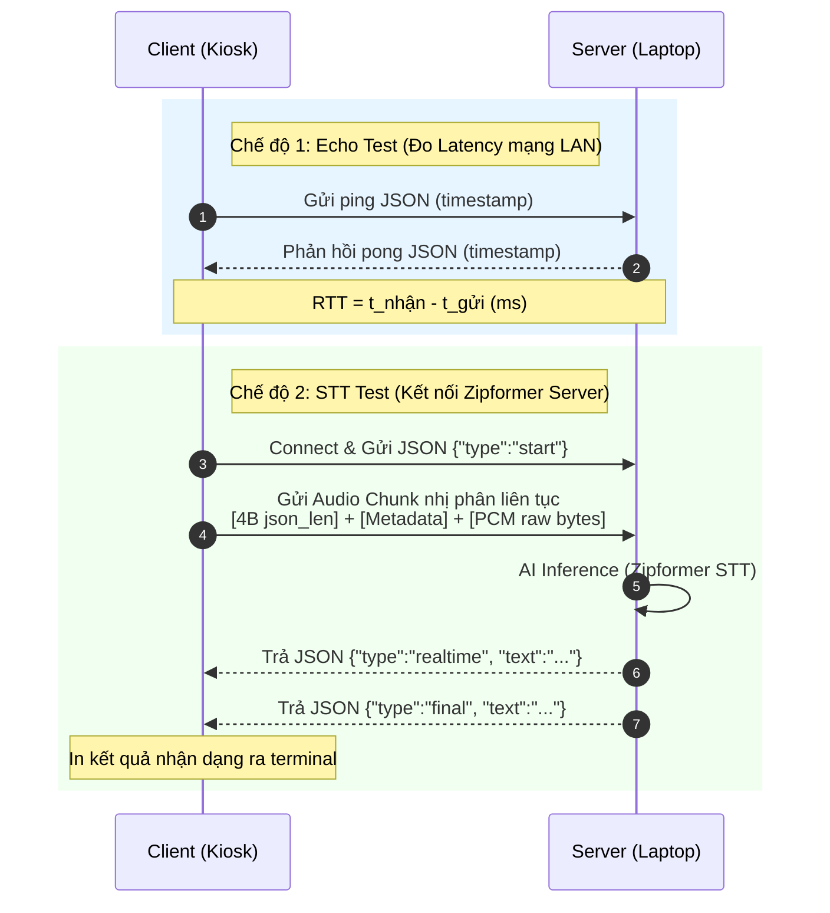

# Kịch Bản Kiểm Thử Kết Nối Kiosk - Laptop (STT Realtime Pipeline)

Thư mục này là bộ công cụ độc lập dùng để:
1. **Kiểm tra kết nối mạng LAN**: Đo đạc độ trễ Round-Trip Time (RTT) và kiểm tra Firewall giữa Kiosk (chạy Windows) và Laptop (Ryzen CPU/RTX GPU).
2. **Stream âm thanh nhị phân**: Gửi âm thanh liên tục dạng gói tin nhị phân tương thích với giao thức của Zipformer STT server.
3. **Hiển thị kết quả STT thời gian thực**: Kết nối trực tiếp đến server `stt_zipformer_vi_server` để in chữ nhận dạng ra terminal của Kiosk ngay lập tức (không chạy TTS).

---

## 1. Sơ Đồ Hoạt Động (Architecture Flow)



---

## 2. Chuẩn Bị & Cài Đặt (Installation)

Trước khi chạy, cần cài đặt các thư viện cần thiết trên cả hai máy.

```powershell
pip install -r requirements.txt
```

*Lưu ý về `PyAudio` trên Kiosk:*
Nếu bạn muốn test thu âm trực tiếp từ microphone của Kiosk, cần cài đặt `PyAudio`. Nếu gặp lỗi khi cài PyAudio trên Windows, hãy dùng pip để cài phiên bản wheel tương thích, hoặc chỉ sử dụng chế độ test bằng file âm thanh mẫu (tự động sinh sóng âm) mà không cần cài PyAudio.

---

## 3. Hướng Dẫn Chạy Kiểm Thử (How to Run)

### Kịch bản A: Test đường truyền mạng LAN thô (Echo Mode)

Chạy kịch bản này trước để đảm bảo hai máy thông mạng và tường lửa (Firewall) không chặn cổng.

1. **Trên Laptop (chạy Server Echo)**:
   ```powershell
   python server_echo.py --host 0.0.0.0 --port 8020
   ```

2. **Trên Kiosk (chạy Client Echo)**:
   Thay `<laptop-ip>` bằng địa chỉ IP của Laptop trong mạng LAN (ví dụ: `192.168.1.50`).
   ```powershell
   python client_test.py --server ws://<laptop-ip>:8020 --mode echo
   ```
   *Quan sát*: Bạn sẽ thấy log Ping/Pong được in ra kèm theo thông số RTT mạng và chuỗi stream văn bản giả lập được gửi liên tiếp từ Laptop về Kiosk.

---

### Kịch bản B: Test gửi Audio & Nhận dạng STT thật

Sau khi mạng LAN đã thông suốt, tiến hành kiểm tra khả năng nhận diện giọng nói tiếng Việt bằng server Zipformer thật.

1. **Trên Laptop (chạy STT Server thật)**:
   Di chuyển vào thư mục `stt_zipformer_vi_server` và khởi chạy server trên tất cả IP LAN:
   ```powershell
   cd D:\work\project_company\kiosk\experiments\realtime_voicebot_lab\stt_zipformer_vi_server
   .\.venv\Scripts\python.exe .\backend_server.py --host 0.0.0.0 --port 8010
   ```

2. **Trên Kiosk (chạy Client gửi Audio & Nhận Text)**:
   * **Cách 1: Test bằng âm thanh mẫu tự động (Khuyên dùng ban đầu)**:
     Client sẽ tự động tạo một file sóng âm hợp âm hình sin `.wav` chuẩn 16kHz mono nếu chưa có sẵn file, sau đó truyền nhị phân sang Laptop.
     ```powershell
     python client_test.py --server ws://<laptop-ip>:8010/ws/transcribe --mode stt --source file --file sample_voice_input.wav
     ```
   * **Cách 2: Test bằng Microphone trực tiếp (Nói tiếng Việt)**:
     ```powershell
     python client_test.py --server ws://<laptop-ip>:8010/ws/transcribe --mode stt --source mic
     ```
     *Quan sát*: Hãy nói tiếng Việt vào micro của Kiosk, chữ nhận dạng tạm thời (màu vàng) và chữ nhận dạng hoàn tất (màu xanh lá) sẽ hiển thị trực tiếp trên màn hình Kiosk của bạn theo thời gian thực!

---

## 4. Xử Lý Sự Cố (Troubleshooting)

* **Lỗi `ConnectionRefusedError` hoặc Timeout**:
  * Đảm bảo cả hai máy đang kết nối chung một bộ phát Wi-Fi hoặc cùng mạng LAN.
  * Tường lửa trên Laptop có thể đang chặn kết nối cổng `8010`/`8020`. Hãy mở Firewall cổng này hoặc tạm thời tắt Windows Defender Firewall của mạng Private để test.
* **Lỗi `PyAudio` không thể khởi động**:
  * Kiểm tra xem Kiosk đã có micro kết nối chưa.
  * Nếu không có micro phần cứng, hãy luôn sử dụng tham số `--source file` để test kết nối thông qua file âm thanh mẫu.
